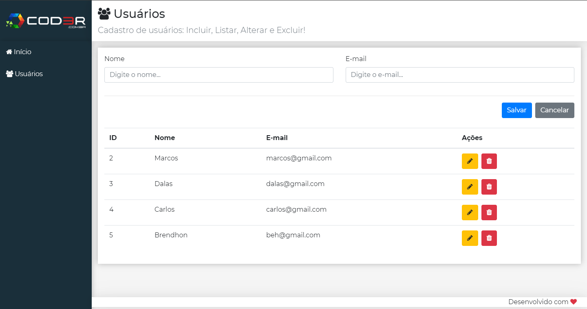

# Projeto Cadastro de Usuário
Este projeto tem como objetivo colocar em prática o conhecimento adquirido sobre **React** no Curso Web Moderno da [COD3R](https://www.cod3r.com.br/).



## Bibliotecas
A seguinte biblioteca foi utilizada na construção do projeto:
 * React
 
## Como usar?

### Requisitos
 * Node.js
 
#### Obs
 * Certifique-se de ter todas as variáveis de ambiente configuradas
 
#### Clone
```
git clone https://github.com/Brendhon/CadastroUsuario.git
```
#### Comandos
Entre na pasta backend e baixe as dependências
```
npm i
```
Ainda na pasta backend
```
npm start
```
**Faça o mesmo processo dentro da pasta frontend**

## License
[MIT](https://choosealicense.com/licenses/mit/)
